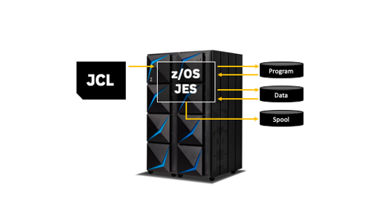

# JCL - Job Control Language

This tutorial is going to help you learn the basics about JCL, through a modern way, using the tools that you are used to, to practice locally on your machine using scripts to track your progress.

##Setting your environment
To follow this you need to have:
1. Git - https://git-scm.com/book/en/v2/Getting-Started-Installing-Git
2. NodeJS - https://nodejs.org/en/download/
3. VSCode(Or any other editor) - https://code.visualstudio.com/download
4. IBM Z Open Editor - https://ibm.github.io/zopeneditor-about/

Scripts included:
```

```
## Getting Started

Clone this repository:
```
git clone git@github.com:billpereira/jcl-study.git
```

Through the <strong>JCL</strong> we can tell the system what programs to run, what files we are handling. This unit where we code our JCL is called <strong>Job</strong>.

When we submit our jobs, our JCL, once selected to run by a component called <strong>JES</strong>, will get the program to run, allocate any data needed, and at the end it may be deleted, stay in special area called spool or even saved for future reference.

<div align="center"></div>