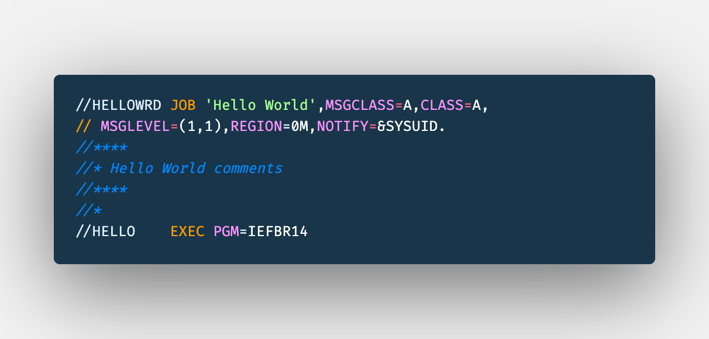

# JCL - Job Control Language

This tutorial is going to help you learn the basics about JCL, through a modern way, using the tools that you are used to, to practice locally on your machine using scripts to track your progress.

## Setting your environment
To follow this you need to have:
1. Git - https://git-scm.com/book/en/v2/Getting-Started-Installing-Git
2. NodeJS - https://nodejs.org/en/download/
3. VSCode(Or any other editor) - https://code.visualstudio.com/download
4. IBM Z Open Editor - https://ibm.github.io/zopeneditor-about/

Scripts included:
```

```
## Getting Started

Clone this repository:
```
git clone git@github.com:billpereira/jcl-study.git
```

Through the <strong>JCL</strong> we can tell the system what programs to run, what files we are handling. This unit where we code our JCL is called <strong>Job</strong>.

When we submit our jobs, our JCL, once selected to run by a component called <strong>JES</strong>, will get the program to run, allocate any data needed, and at the end it may be deleted, stay in special area called spool or even saved for future reference.

<div align="center"></div>

The programs we call, has internal references to file names, which are opened for read/write operations. JCL will associate these references with the physical resources.

## JCL Syntax and our Hello World

Our JCL Instructions, also called statements or cards, start with `//` on the first column and unless a information would be inside of quotes, it should be always uppercase.

The next 8 characters after `//` are used to name the statement.

To Start let's create our first job, our HELLOWRLD. All jobs need to contain at least a JOB and a EXEC statement.

<div align="center"></div>

- JOB word identify our JOB Statement, it marks the beginning of our job and assigns a name to it
  - (#ACCT) - This is a positional parameter, used for accounting, to identify for example the team/department responsible for this job 
  - 'Hello World' - We can assign a short description for our job.
  - MSGCLASS - We saw before that when a job runs, it may be saved, may be on a spool area, this parameter is responsible to identify where the output execution will stay after execution
  - CLASS -  The job class can affect whether or how a job is executed
  - MSGLEVEL - We are using the MSGLEVEL to print all statements and all messages related to them
  - REGION - We use to say in which area of memory or job can run
  - NOTIFY - Here we are using variable `SYSUID` to when this job completed inform who submitted it about its completion
  - SYSAFF - Sometimes we have more systems available working together on what we call as JES Complex, so we can inform in which system it needs to run

- EXEC word identify our EXEC Statement, we also call each of this as Steps, it identify a program or a procedure to be executed
  - PGM - On our exec, we are calling a program an utility, called `IEFBR14`. 
  - IEFBR14 - It is a placeholder that returns the exit status zero, similar to the true command on UNIX-like systems.

<div align="center"></div>
